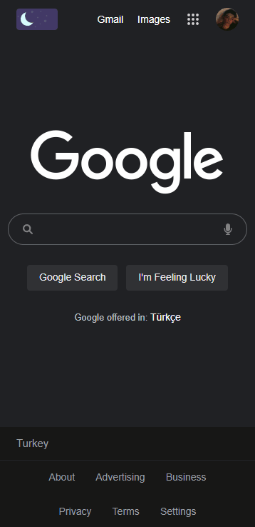

# google-clone

This is a "Google Clone" website and it was made for the Patika.dev homework.

 

# Desktop

 

# Mobile

 

# Which technologies did I use in this project?

- HTML5
- CSS3
- SCSS/SASS
- Bootstrap
- JavaScript
- jQuery